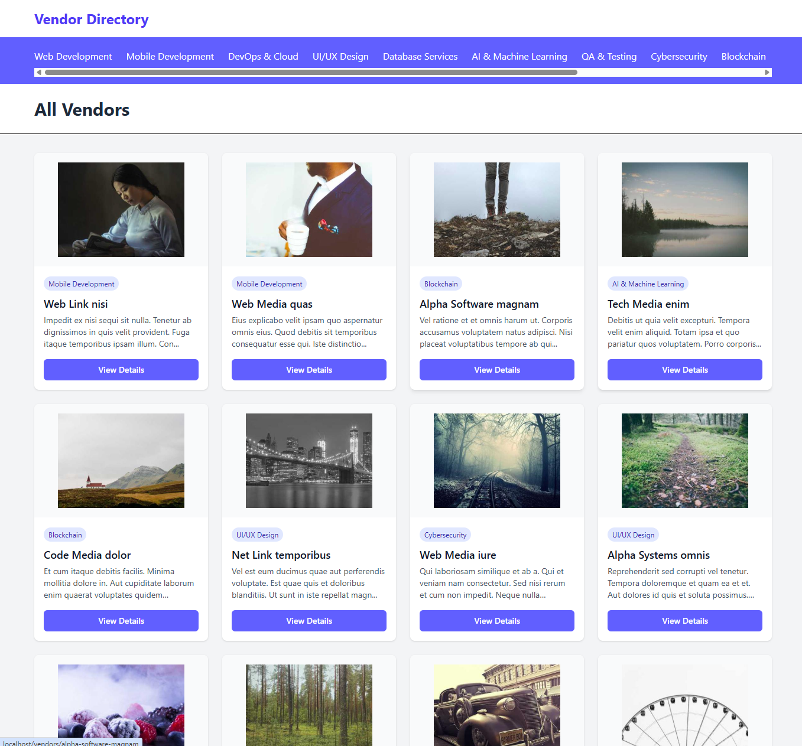

# Vendor Directory

A simple Laravel application for displaying vendors organized by categories.

## Tech Stack

- **Backend**: Laravel
- **Database**: MySQL with Eloquent ORM
- **Frontend**: Blade with Tailwind CSS
- **Performance Monitoring**: Laravel Telescope (development only)

## Design Decisions

A simple Laravel + Blade application. For the backend, I've used a service/repository pattern though the app is so simple that there were no services needed. As requested, used Eloquent ORM & added Telescope so you can quickly confirm there is no N+1 issues as stated in the requirements (for production deployment Telescope would be disabled completely or enabled only when a certain flag is passed in the URL). For the frontend, I've used Blade templating with Tailwind. For lazy loading I've used native `loading="lazy"` so to not use external libraries and not make the system more complex without benefit. `loading="lazy"` is NOT applied to the first 12 loop elements to avoid having it on items that are initially in the viewport (not doing so may cause issues with LCP).

## Performance Optimizations

- As stated in areas for future enhancement, images could have `srcset` attribute to support more responsiveness

## Areas for Future Enhancement

Since the task description is pretty vague and the project itself could be vastly more professional, there's tons of place for improvements, such as:

- More professional design.
- Showing categories in a dropdown or other more appealing way.
- Images could have `srcset` attribute to support more responsiveness.
- Category links in vendor loop component should lead to category page.
- Infinite loading of vendors or pagination.
- Adding Unit tests, however at the moment there are no service classes in the app, so there's nothing to test. Testing repository classes/methods would be pointless and would benefit from integration testing but that would go beyond a small scope of test task.
- Adding exceptions with exceptions handling when a category or vendor by slug doesn't exist.

## Requirements Met

- ✅ Laravel 12
- ✅ Eloquent ORM usage
- ✅ No N+1 query issues (verified via Telescope)
- ✅ Performance-conscious image loading
- ✅ Clean, maintainable code structure